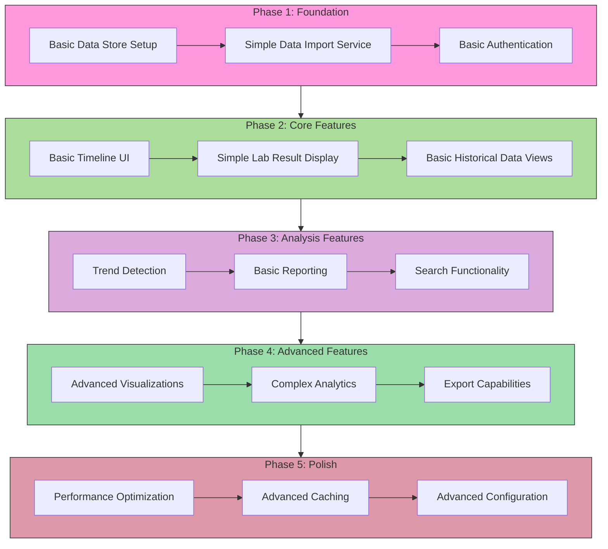

# File: system-abstract.md

# MORISTAT Patient History Management System
## System Abstract

MORISTAT is a specialized healthcare information system designed to provide patients with comprehensive access to and understanding of their complete medical history. Unlike traditional EMR/EHR systems focused on active treatment and day-to-day care, MORISTAT serves as a longitudinal health record aggregator and visualization platform, empowering patients with insights into their health journey over time.

### System Purpose
The platform's primary focus is to:
- Aggregate historical medical data from various sources
- Present medical history in an accessible, understandable format
- Track long-term health trends and patterns
- Maintain a comprehensive record of past treatments, lab results, and diagnoses
- Enable patients to be better informed about their overall health journey

### Core Architecture
The system employs a modular architecture with the following key components:

#### 1. Data Management
- [[tech-specs#Historical Data Store|Historical Data Store]]
- [[tech-specs#Data Import Service|Data Import Services]]
- [[tech-specs#Historical Data Configuration|Data Configuration]]

#### 2. User Interface
- [[tech-specs#Timeline Dashboard System|Timeline Dashboard]]
- [[tech-specs#Historical Data Visualization|Data Visualization]]
- [[tech-specs#Data Import Interface|Import Interface]]

#### 3. Analysis & Processing
- [[tech-specs#Historical Data Processors|Data Processing]]
- [[tech-specs#Trend Analysis Engine|Trend Analysis]]
- [[tech-specs#Search Index|Search Capabilities]]

See [[development-sequence#Development Roadmap|Development Roadmap]] for implementation planning.

### Technical Foundation
- [[tech-specs#Technical Stack Considerations|Technical Stack]]
- [[tech-specs#Performance Considerations|Performance Optimization]]
- [[tech-specs#Implementation Priorities|Implementation Strategy]]

### Development Approach
For detailed development phases and timelines, see:
- [[development-sequence#Phase 1|Foundation Phase]]
- [[development-sequence#Phase 2|Core Features Phase]]
- [[development-sequence#Phase 3|Analysis Phase]]
- [[development-sequence#Phase 4|Advanced Features Phase]]
- [[development-sequence#Phase 5|Polish Phase]]

---

# File: development-sequence.md

# Development Roadmap

## Overview
This document outlines the phased development approach for the MORISTAT system. Each phase builds upon previous work while maintaining a functional system throughout development.

## Phase Details

### Phase 1: Foundation
- [[tech-specs#Historical Data Store|Data Store Implementation]]
- [[tech-specs#Data Import Service|Import Service Development]]
- [[tech-specs#Integration Layer|Authentication System]]

### Phase 2: Core Features
- [[tech-specs#Timeline Dashboard System|Timeline Interface]]
- [[tech-specs#Lab Range Definitions|Lab Results Display]]
- [[tech-specs#Historical Data Visualization|Historical Views]]

### Phase 3: Analysis Features
- [[tech-specs#Trend Analysis Engine|Trend Detection]]
- [[tech-specs#Report Template Settings|Basic Reporting]]
- [[tech-specs#Search Index|Search Implementation]]

### Phase 4: Advanced Features
- [[tech-specs#Historical Data Visualization|Advanced Visualizations]]
- [[tech-specs#Trend Analysis Engine|Complex Analytics]]
- [[tech-specs#Export Service|Export System]]

### Phase 5: Polish
- [[tech-specs#Performance Considerations|Performance Optimization]]
- [[tech-specs#Technical Stack Considerations|Advanced Caching]]
- [[tech-specs#Configuration Systems|Advanced Configuration]]

[Previous tech-specs.md content remains the same but with proper header hierarchy for linking]